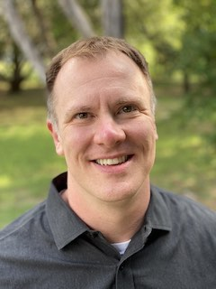

# Barrett Cervenka
## Principal Software Engineer & Consultant

### Resume
[My resume is available here.](barrettcervenka.pdf)

### Contact
&#98;&#97;&#114;&#114;&#101;&#116;&#116;&#64;&#99;&#101;&#114;&#118;&#101;&#110;&#107;&#97;&#46;&#99;&#111;&#109;

### My Profiles
* [LinkedIn](https://www.linkedin.com/in/barrettcervenka)
* [GitHub](https://github.com/barrettc)

### About
I'm a software engineer living and working in Austin, Texas. I graduated from [Texas A&M University](http://www.tamu.edu) with a degree in Computer Engineering and have held a variety of roles at companies such as Vignette (now [OpenText](http://www.opentext.com)) and [Electronic Arts](http://www.ea.com). I currently work at [Ballista Technology Group](https://www.ballista.com) as a Principal Consultant focusing on custom development for our clients.

I've had an interest in technology as far back as I can remember and still love solving problems and making lives easier through software. Outside of work, I keep busy with my wife and our two daughters.

